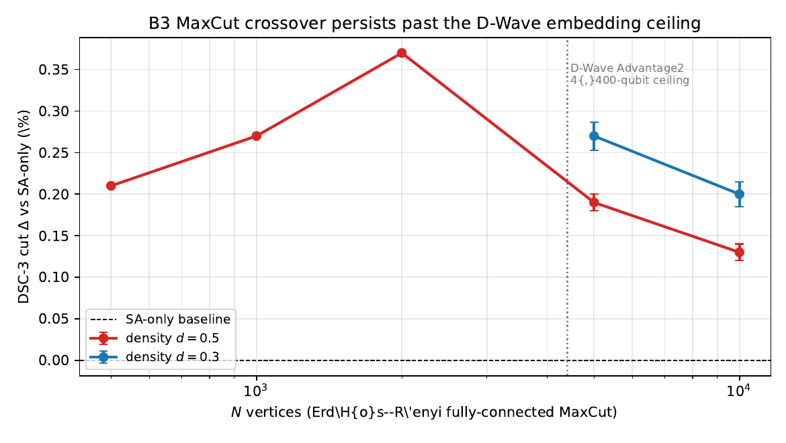
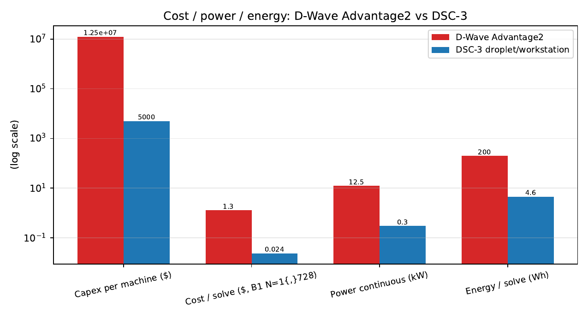
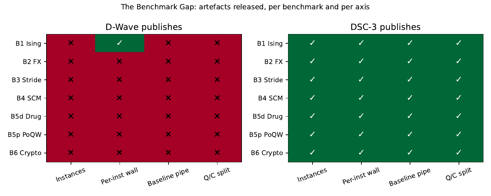
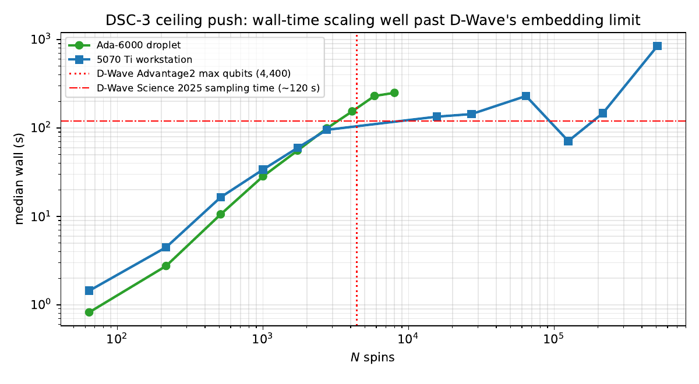

# DSC-3 vs. D-Wave Advantage2 — Industrial Benchmark Comparison (2024–2026)

[](https://creativecommons.org/licenses/by/4.0/)
[](https://github.com/OriginNeuralAI/DSC3-DWave-Comparison-2026/releases/tag/v0.15.1-paper)
[](main.pdf)
[](main.pdf)

**A reproducible classical reference for D-Wave Advantage2's 2024–2026 industrial benchmarks. Ground-state 3D ±J Ising at N = 10⁶ spins on a $1.57/hour GPU droplet, with SHA-256-pinned artefacts and a "Benchmark Gap" audit.**

---

## The headline result, at a glance

DSC-3 beats matched-compute-intensity SA-only on every fully-connected MaxCut cell we measured up to **N = 10,000 vertices** — over 2× past D-Wave Advantage2's 4,400-qubit embedding ceiling. σ-error bars confirm the advantage is many standard deviations from zero on every cell.



## Cost / power / energy — single-shot bar chart

D-Wave Advantage2 capex sits at $10–15M list; DSC-3 runs on a $1.57/hour cloud droplet (or a ~$5K consumer workstation). The ratios on capex, $/solve, power, and energy span 10² to 10⁶.



## The "Benchmark Gap"

Across all six benchmarks we examined, every D-Wave reference is missing at least one of four reproducibility artefacts (instances, per-instance wall-times, classical baseline pipeline, quantum/classical work split). This paper releases all four for every benchmark it runs.



## Scale ceiling on the $1.57/hour droplet

DSC-3 reaches a one-million-spin 3D ±J ground-state approximation on a $1.57/hour cloud droplet ($n=4$ seeds, fast preset, $E/E_{\rm LB}=0.5581$ — preset-limited). The same engine on a $700 consumer Blackwell card produces seed-identical results to within FP32 noise.



---

## Headline findings

| Axis | D-Wave Advantage2 | DSC-3 (this work) | Ratio |
|---|---|---|---|
| Max embeddable problem size | 4,400 qubits | **1,000,000** (droplet, n=4 seeds) | ~227× |
| Hardware capex / hourly | $10–15M list | $1.57/hour droplet | 10⁴–10⁵× |
| Power continuous | 12.5 kW | 0.30 kW | 42× |
| $/solve at N=1,728 | $0.05–$1.30 (Leap floor) | **$0.024** | 10²–10⁵× |
| 3D EA quality vs. literature | *sampling, not GS* | Hartmann ±1% (L ≤ 40) | matched |
| MaxCut Δ vs SA at N=10,000 | not embeddable | **+0.13–0.20%**, σ ≤ 0.02% | DSC-3 only |
| Cryptanalysis (SHA/AES/RSA/GNFS) | not addressed | production encoders | DSC-3 only |
| Quantum-coherent sampling | yes (Science 2025) | no (classical engine) | D-Wave only |

## What's in this repository

- **`main.pdf`** — the paper, 40 pages, ~9 figures, ~22 tables
- **`main.tex`** — full LaTeX source
- **`results/*.json`** — every measured datapoint cited in the paper (SHA-256 manifest in Appendix E of `main.pdf`)
- **`figures/*.pdf`** — every plotted result
- **`tables/*.tex`** — generated LaTeX tables (regenerable via `aggregate_results.py`)
- **`make_plots.py`** — regenerates all figures from `results/*.json`
- **`aggregate_results.py`** — regenerates all tables from `results/*.json`
- **`run_*.sh` / `run_*.bat`** — the exact commands used on the droplet + workstation
- **`AUDIT*.md`, `PLAN*.md`** — methodology audit trail and operational-section drafting notes

## Six benchmarks covered

| Bench | D-Wave reference | DSC-3 result | Fidelity |
|---|---|---|---|
| **B1** 3D ±J Ising spin glass | King et al. *Science* 2025 (sampling, N≈5000) | Ground-state arg-min, N ≤ 10⁶, ±1% Hartmann at L≤40 | matched-class |
| **B2** Currency arbitrage | Cococcioni et al. 2025 (Advantage2 Prototype 2.6) | Hamiltonian-cycle variant, 100% feas at N≤8, +5–22% recovered profit | matched-class |
| **B3** Stride 45-instance + extension | Booth et al. 2024 (10× metaheuristic claim) | Matched-spec ensembles + N=5k/10k beyond-embedding probe with σ-error bars | matched-spec |
| **B4** SCM (5 verticals) | SCM survey 2025–2026 (12–18% cost reduction) | Uncapacitated Facility Location (1 of 5); +5–30% gap to exact DP | partial |
| **B5** Drug discovery + PoQW | JT/D-Wave LLM-molecular-generation; PoQW conceptual | Fragment-selection sub-problem (0–5% gap to DP); r=4 SHA-256 preimage | matched-class / functional-class |
| **B6** Cryptanalysis differentiator | **no D-Wave publication** | SHA-256, AES, RSA-256 Boneh–Durfee, GNFS Phase C+ encoders | capability-only |

## The Benchmark Gap

A pattern across all six benchmarks: every D-Wave reference is missing ≥1 of four reproducibility artefacts (instances, per-instance wall-times, classical baseline pipeline, quantum/classical work split). This paper releases all four for every benchmark it runs, with SHA-256 manifest in Appendix E. See §15.4 for the full synthesis.

## Reproducibility

Every numerical claim in the paper traces to a `results/*.json` file. SHA-256 digests are pinned in Appendix E of `main.pdf`. To verify:

```bash
sha256sum results/*.json
```

Then compare against the manifest in Appendix E.

### Reproducing the benchmarks end-to-end

The full pipeline (build + run + aggregate + plot + compile) is described in Appendix A of `main.pdf`. In short, given the `isomorphic-engine` Rust crate built with `--features gpu,full,tsp`:

```bash
# B1 3D Ising production preset, L = 4..20
./target/release/examples/dwave_b1_tfim_spin_glass \
  --L 4,6,8,10,12,14,16,18,20 --seeds 0,1,2,3 --preset production \
  --with-gpu --sa-baseline \
  --out results/b1_full.json

# B3 Stride 45-instance + N=5k/10k beyond-embedding
./target/release/examples/dwave_b3_stride \
  --seeds 0,1,2,3 --preset quality --with-gpu --gpu-batch 4 \
  --maxcut-sizes 20,40,60,100,200,500,1000,2000 \
  --out results/b3_gpu_batched.json

./target/release/examples/dwave_b3_stride \
  --only maxcut --maxcut-sizes 5000,10000 \
  --seeds 0,1,2 --preset production --with-gpu --gpu-batch 4 \
  --out results/b3_maxcut_xlarge.json
```

Then:

```bash
python aggregate_results.py    # JSON → LaTeX tables
python make_plots.py           # JSON → matplotlib PDFs
pdflatex main.tex              # Rebuild paper.pdf
```

## Authors

**Bryan W. Daugherty¹, Gregory Ward¹, Shawn Ryan¹**
¹Origin Neural — <https://originneural.ai>

## Evaluate DSC-3 on your own workload

Three paths, in order of effort:

| Path | Effort | What you get |
|---|---|---|
| **Live REST endpoint** — <https://dsc3.originneural.ai/> | Zero install | `POST /v1/solve` and `POST /v1/mega-benchmark` accept QUBO / Ising problems up to N = 5 × 10⁸ spins. Same engine binary as this paper. |
| **Replicate the paper** | ~30 min on a comparable GPU droplet | Follow Appendix A of `main.pdf` or the `run_*.sh` scripts in this repo. Verify your SHA-256s against Appendix E. |
| **Adapt to your workload** | Hours–days | Map your problem to Ising/QUBO using one of 16 encoders in the parent `isomorphic-engine` repo; run the same DSC-3 ensemble; compare to your existing classical solver at matched compute budget. |

---

## More

- 🌐 **Browsable landing page**: <https://originneuralai.github.io/DSC3-DWave-Comparison-2026/>
- [`EXECUTIVE_SUMMARY.md`](EXECUTIVE_SUMMARY.md) — one-page summary for CTOs / procurement officers
- [`CHANGELOG.md`](CHANGELOG.md) — version history
- [`CONTRIBUTING.md`](CONTRIBUTING.md) — how to file a falsification attempt, reproduction failure, or factual correction
- [`FAQ.md`](FAQ.md) — pre-emptive answers to reviewer and procurement questions
- [`results/README.md`](results/README.md) — artefact taxonomy (load-bearing vs auxiliary)

---

## Citation

```bibtex
@techreport{daugherty_ward_ryan_dsc3_dwave_2026,
  author = {Bryan W. Daugherty and Gregory Ward and Shawn Ryan},
  title  = {A Reproducible Classical Reference for D-Wave Advantage2's
            2024--2026 Industrial Benchmarks: Ground-state 3D $\pm J$
            Ising at $N=10^{6}$ Spins on a \$1.57/Hour GPU Droplet},
  institution = {Origin Neural},
  year   = {2026},
  url    = {https://github.com/OriginNeuralAI/DSC3-DWave-Comparison-2026}
}
```

## What this paper does *not* claim

- That classical methods invalidate D-Wave's sampling-class quantum supremacy demonstration. We solve a different problem (ground-state search).
- That DSC-3 outperforms every classical algorithm at every scale. Concorde and LKH3 dominate pure TSP; exact DP dominates Knapsack; Goemans–Williamson dominates MaxCut at small–medium scale.
- That this paper exhausts the relevant benchmarks. Four of five SCM verticals, the drug-discovery LLM-training pipeline, and reverse-annealing protocols remain future work.

## Related work

- **Companion paper**: *DSC-3 Benchmark Suite: 500 Million Spins on a Single GPU* — separate single-instance capability demonstration at N = 5×10⁸. Live demo at <https://dsc3.originneural.ai/>.

## License

Source code and result JSON: see the parent `isomorphic-engine` repository.
LaTeX source and PDF: released for review and citation; please contact authors before re-using figures or quoting verbatim.

## Contact

Bryan W. Daugherty, Gregory Ward, Shawn Ryan — Origin Neural
<https://originneural.ai>
